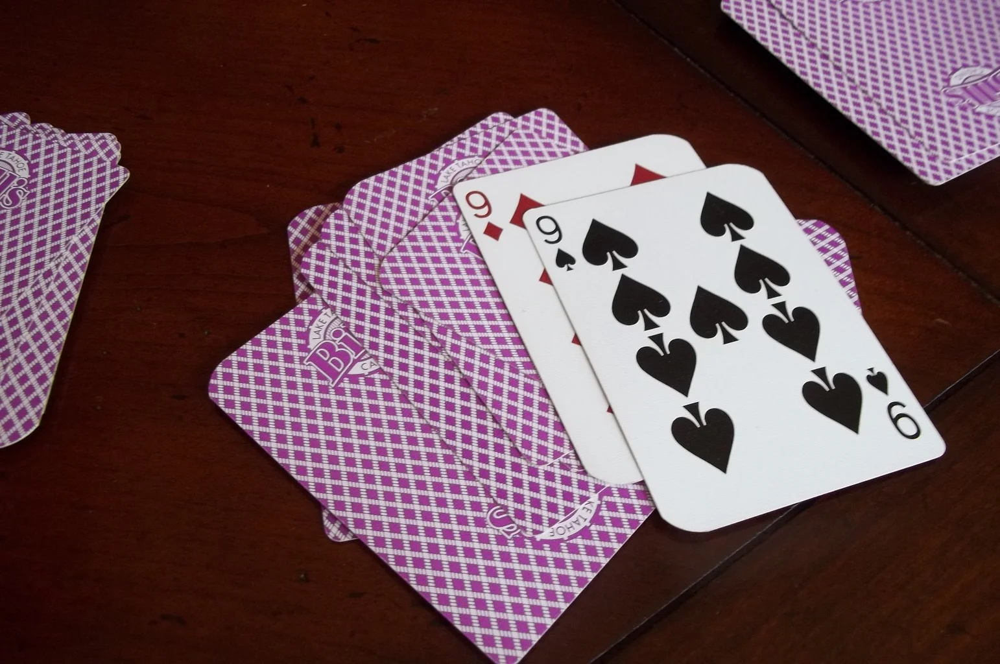

# Reinforcement Learning for the Card Game BS



BS Environment, custom BS agents, RL agents, rule-based agents, etc.

# Getting Started

## Installation
```console
> git clone https://github.com/eassmus/bs-rl.git
> cd bs-rl
```

For conda: 
```console
> conda create -n bs-rl python=3.11
> conda activate bs-rl
> pip install -r requirements.txt
```

For venv (I never use venv so idk if this is accurate):
```console
> python -m venv bs-rl
> source bs-rl/bin/activate
> pip install -r requirements.txt
```

# Scripts
## Find Agents Elo
Runs some default agents against each other in many BS games and finds a final elo for each agent.
```console
> python agent_matchmaker.py
```

Sample Output:
```console
Elo Ratings and Total Wins (Sorted by Elo):
SmartSimpleAngent Elo: 1543.60, Wins: 6431
AggressiveAgent Elo: 1301.34, Wins: 2925
SimpleAgent Elo: 1276.53, Wins: 2617
RandomAgent Elo: 678.53, Wins: 27
```

# Features
asdfjkasdkjfl
